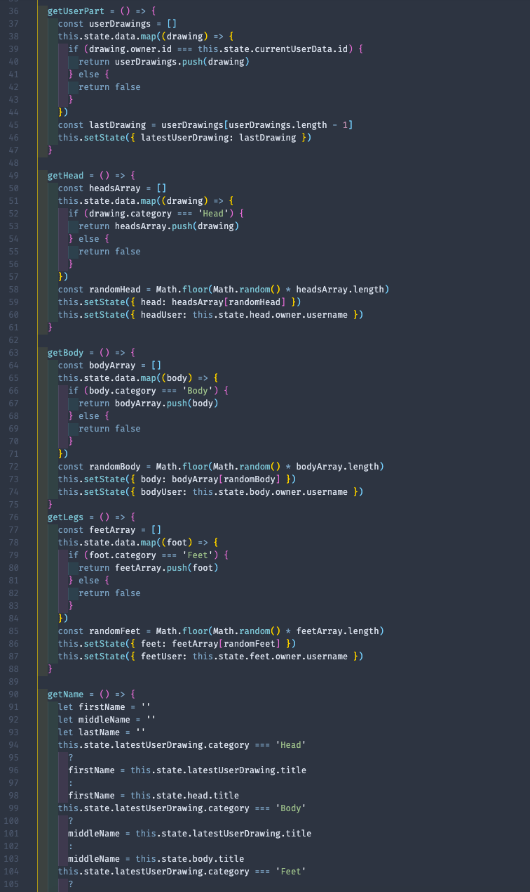
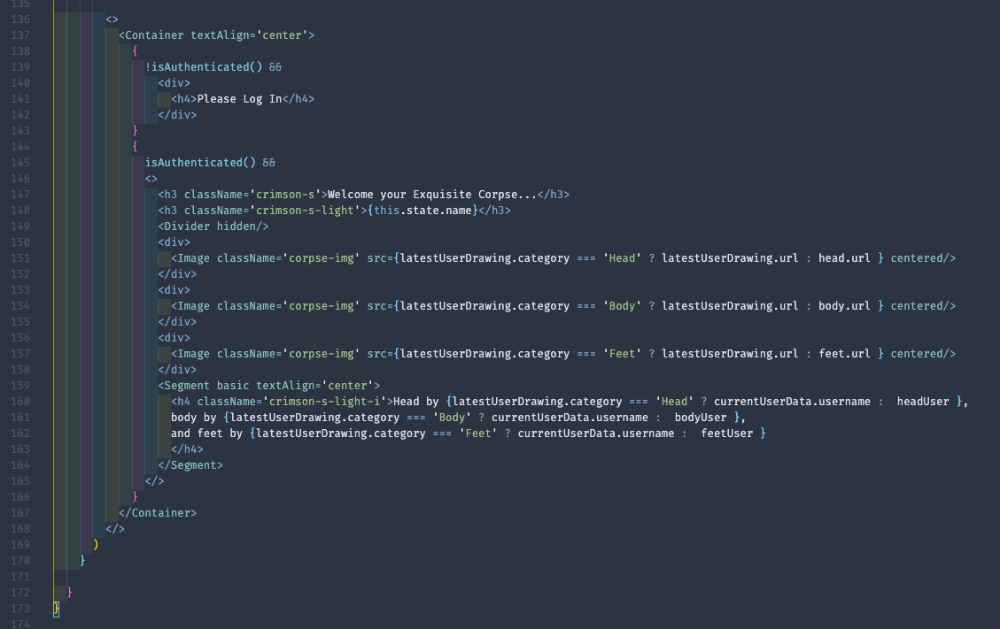
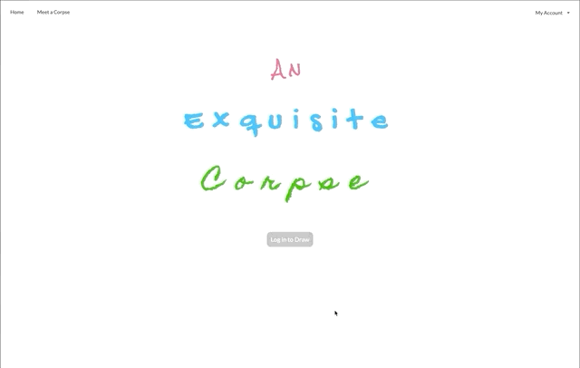
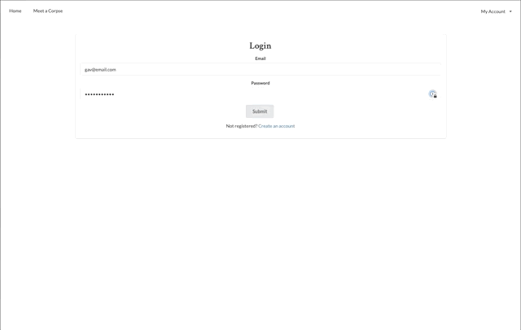
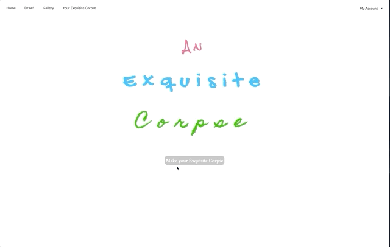
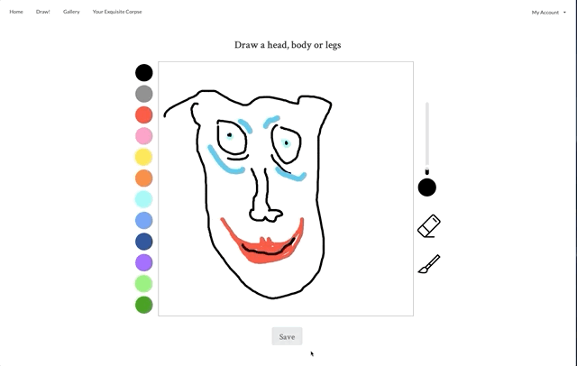
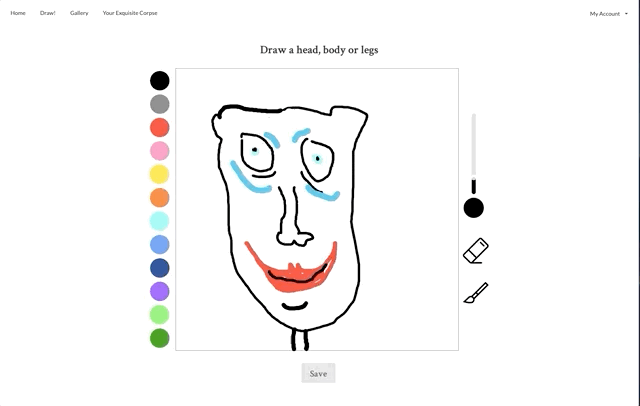

# General Assembly SEI Final Project ‘An Exquisite Corpse’ 🎨

## Vew the Deployed Site Here:

[An Exquisite Corpse](https://an-exquisite-corpse.herokuapp.com/)

## Overview:

As my final project for the General Assembly SEI course, I chose to make a drawing app using Konva.js inside of a React project to work with HTML canvas. The app is full-stack, with a Django back-end.

The basic concept is for the user to take part in creating an [‘Exquisite Corpse’](https://en.wikipedia.org/wiki/Exquisite_corpse) drawing, a simple drawing game in which someone draws a head, folds the paper, then passes it to someone else who draws the body, then again to someone else to draw the legs. When unfolded, it reveals a unique/weird/funny composition of a whole person/animal/thing.

The user chooses to draw a part of the body (head, body or feet). Once completed, they are presented with a full drawing composed of their image combined with randomly generated drawings from previous users. Their original drawing would then be saved to the back-end and used in future users compositions.

The app requires a user to make an account before being able to submit a drawing or view the rest of the database however a viewer can still see a randomly generated example of a full drawing without logging in.

After researching various ways to use HTML canvas techniques to build the drawing functionality, I ended up using [Konva.js](https://konvajs.org/) as it seemed to be more adaptable to React than some of the other options like [P5.js](https://p5js.org/).

## Technical Brief:

* **Build a full-stack application** by making the Front and Back-end.
* **Use a Python Django API** using Django REST Framework to serve your data from a Postgres database.
* **Consume your API with a separate Frontend** built with React.
* **Deploy your app online.** Make it publicly accessible.
* **Time Frame**: 7 days.

## Technologies:

* JavaScript
* React.js
* Python
* Django
* Konva.js & HTML Canvas
* CSS & Semantic UI
* Heroku (deployment)

## Technical Process:

* Brainstorming the initial concept. After coming up with an idea, researching possibilities of how it might be accomplished.
* After discovering HTML canvas and Konva.js, begin to learn as much as possible about these new technologies and starting test projects to experiment with ideas of what I might be able to achieve.
* With a clearer idea of how I might be able to use these new techniques, wireframe and plan out a basic visual concept of the finished product.
* Begin working on the back-end. Planning the different models and relationships needed.
* Work out how to save an image to the database - upon research and testing, I settled with saving the drawings as base64 strings rather than an image file such as jpg or png. This would allow me to store the images as normal text entry in the database rather than exporting/uploading files. This allowed me to keep my models more simple and efficient, and allowed me more time to spend on the front-end, which was going to be quite complex.
* Writing the code for registering users, authentication and testing the databse with Insomnia requests.
* Coding a skeleton verison of the drawing app and making sure the relationships with the database were working correctly.
* Fleshing out the drawing app and working in more complexity, such as erasing lines, colour choices, brush size options and finer styling choices like the colour picker and modals for the save options.
* Working on the logic to compose the final images and testing to ensure it was consistently working as intended.
* Leaving time towards the end to work on styling the overall app and layout, including nav bar, conditional rendering, modal pop ups and animating home page text.
* Deploy the finished app to Heroku.

## Challenges:

Learning to use a completely new library like Konva and having never used HTML canvas at all prior to starting this project, it was a ****lot**** to take on board in a very short space of time, so the learning curve was quite steep when working out how to turn the idea into a functioning app.

Another more specific challenge was composing the final images from the data-base combined with the image the user had just drawn. To do this, I needed a way of knowing which was the latest drawing the user had created, and which category the body part was in. Then there was a series of conditions in which requests would be sent to the database for whichever categories would *not* match that which the user had just drawn. As the final image was essentially three images stacked on top of each other, I needed to ensure they were arranged in the correct order. Then, finally - I needed to display the character name that had been given to each part, and the user who had drawn it. Once I had worked out the logic, it was just a matter of some conditional rendering to get everything in the right place.

#### **Here’s an example of the finished code for this part:**

**Conditionally rendering things in the right order based on the results of the above logic:**

It was really rewarding when those parts started coming together though, and I began to get more comfortable trying different ideas and being more creative with my code as it progressed.

## Wins:

The drawing functionality working as well as it does was a big win. It was a lot to take on and learn in the amount of time that I had, and to get the idea that I had at the very beginning translated into a working app was amazing.

Then being able to still build a working back-end database to incorporate with it so that it works as a finished product was something that I’m very proud of.

## Key Learnings:

Learning a new skill with HTML canvas / Konva.js and using it to build a full-stack app solo with Python/Django for the first time.

## Potential Future Features:

I would love to have had time to try and make the app more mobile friendly, I think it would translate really well to mobile if I was able to make the canvas fully responsive for mobile screen sizes, and to add touch functionality to the drawing. However this turned out to be more complex than I had hoped to add in quickly once the rest of the app was complete, it would have require more re-factoring than I had time for towards the end of the project.

## Demo:

Registration and login:

Homepage and starting a drawing:

Completing your drawing and saving to the back-end, then presented with your completed image:

Viewing the gallery of all the other users' previous drawings:

## Resources:
* [Konva.js](https://konvajs.org/)
* [Exquisite Corpse (Wikipedia)](https://en.wikipedia.org/wiki/Exquisite_corpse)

